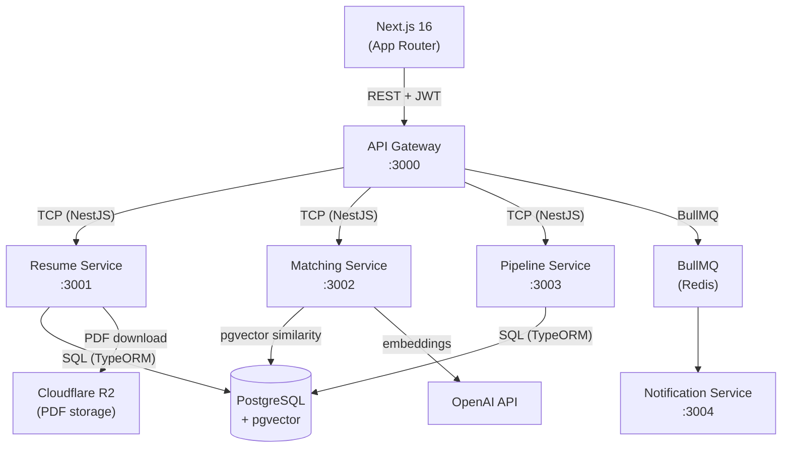

# SmartHire — AI-Powered Hiring Platform

> A multi-tenant, microservices-based hiring platform that uses AI to parse resumes, rank candidates, and manage the hiring pipeline — built with NestJS, Next.js, and pgvector.

## Architecture



## Features

| Feature | Description |
|---------|-------------|
| **Multi-tenant auth** | JWT with tenant scoping — every query is isolated by `tenantId` |
| **Job management** | Create/edit/close jobs; JD embeddings generated asynchronously |
| **Resume upload** | Drag-and-drop PDF bulk upload; async parsing via BullMQ |
| **AI matching** | pgvector cosine similarity ranks candidates against job description |
| **Pipeline kanban** | 6-stage drag-and-drop board with optimistic updates |
| **Candidate slide-over** | Full parsed data, match score, stage history timeline |
| **Toast notifications** | Real-time feedback for every async action |
| **Mobile responsive** | Sidebar collapses to hamburger menu on ≤ 768 px |

## Monorepo structure

```
smart-hiring-platform/
├── apps/
│   ├── web/                  # Next.js 16 frontend
│   ├── api-gateway/          # NestJS — REST entry point
│   ├── resume-service/       # NestJS — PDF parse + R2 upload
│   ├── matching-service/     # NestJS — pgvector embeddings + ranking
│   ├── pipeline-service/     # NestJS — stage transitions + history
│   └── notification-service/ # NestJS — BullMQ email consumer
├── docs/
│   ├── api.md                # Full REST + TCP API reference
│   ├── architecture.md       # Service responsibilities + data flows
│   ├── database.md           # Schema, indexes, RLS policies
│   ├── frontend.md           # Next.js conventions + state management
│   └── TechDecisions.md      # Why each technology was chosen
└── nx.json
```

## Prerequisites

| Tool | Version |
|------|---------|
| Node.js | ≥ 20 |
| Docker + Docker Compose | ≥ 24 |
| pnpm / npm | any |

## Local setup

### 1. Clone and install

```bash
git clone https://github.com/your-org/smart-hiring-platform.git
cd smart-hiring-platform
npm install
```

### 2. Environment variables

Copy the example env file for each service:

```bash
cp apps/api-gateway/.env.example      apps/api-gateway/.env
cp apps/resume-service/.env.example   apps/resume-service/.env
cp apps/matching-service/.env.example apps/matching-service/.env
cp apps/pipeline-service/.env.example apps/pipeline-service/.env
cp apps/web/.env.local.example        apps/web/.env.local
```

Key variables:

| Variable | Service | Description |
|----------|---------|-------------|
| `DATABASE_URL` | all services | PostgreSQL connection string |
| `REDIS_URL` | api-gateway, notification-service | BullMQ broker |
| `OPENAI_API_KEY` | matching-service | Used for JD + resume embeddings |
| `R2_ACCOUNT_ID` | resume-service | Cloudflare R2 for PDF storage |
| `R2_ACCESS_KEY_ID` | resume-service | |
| `R2_SECRET_ACCESS_KEY` | resume-service | |
| `R2_BUCKET` | resume-service | |
| `JWT_SECRET` | api-gateway | HS256 signing key |
| `NEXT_PUBLIC_API_URL` | web | Points to api-gateway (default: `http://localhost:3000/api`) |

### 3. Start infrastructure

```bash
docker compose up -d   # starts PostgreSQL + Redis
```

### 4. Run database migrations

```bash
npm run migration:run
```

### 5. Start all services

```bash
# In separate terminals (or use --parallel):
npx nx serve api-gateway
npx nx serve resume-service
npx nx serve matching-service
npx nx serve pipeline-service
npx nx serve notification-service
npx nx serve web
```

Or all at once:

```bash
npx nx run-many --target=serve --all --parallel=6
```

The frontend is available at **http://localhost:4200**.

## Key workflows

### Upload resumes and run AI match

1. Create a job at `/jobs/new`
2. Click **Upload resumes** → drag PDFs → watch per-file parse status
3. Once all resumes show **done**, click **✦ Run AI match**
4. Candidates re-rank by match score — click any row to open the slide-over

### Move a candidate through the pipeline

1. Navigate to `/jobs/:id/pipeline`
2. Drag a candidate card to a new column
3. The stage updates optimistically; a success toast confirms the API call
4. If the API fails, the card snaps back to its original column and an error toast appears
5. The pipeline service publishes to BullMQ → notification service emails the candidate

## API reference

Full REST + TCP message patterns: [`docs/api.md`](docs/api.md)

## Tech decisions

Why TypeORM, why pgvector, why BullMQ — all documented in [`docs/TechDecisions.md`](docs/TechDecisions.md)

## Running tests

```bash
npx nx test api-gateway
npx nx test resume-service
npx nx test matching-service
```

## Building for production

```bash
npx nx build web
npx nx build api-gateway
# (repeat for each service)
```
